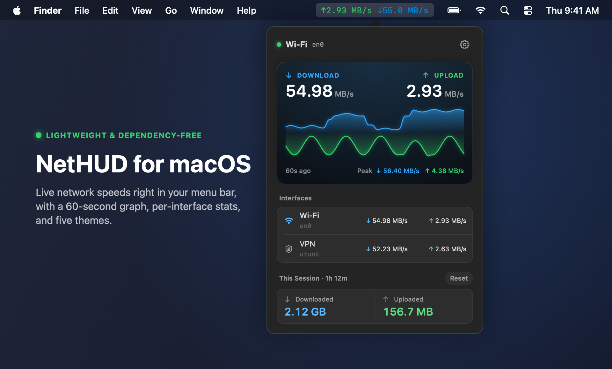
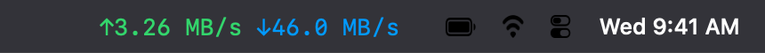
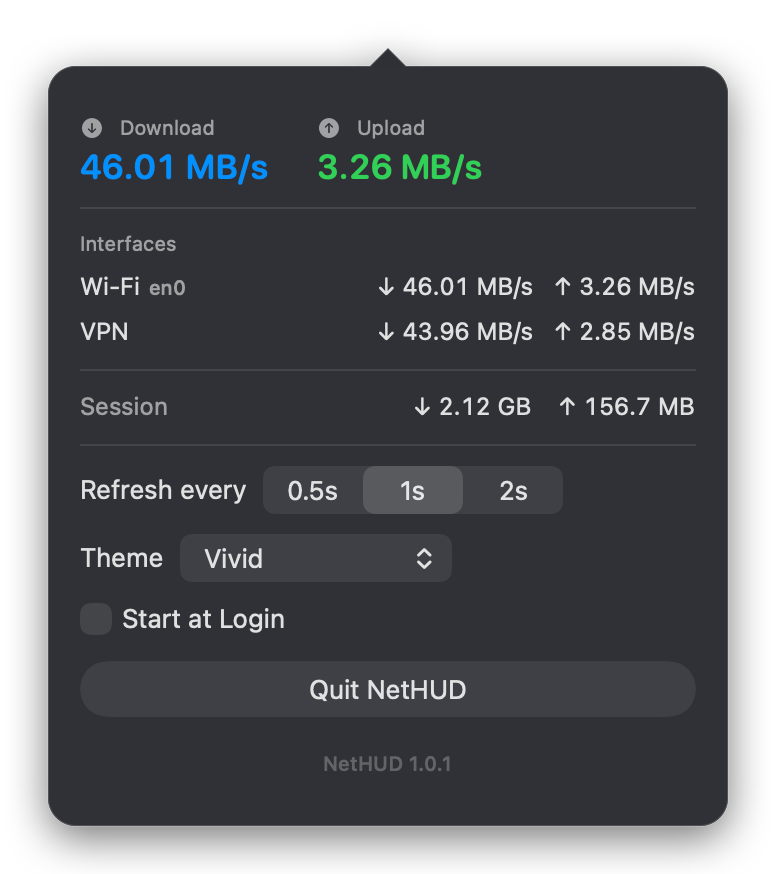
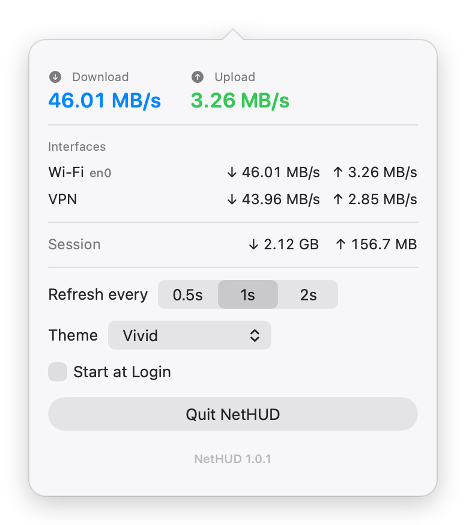
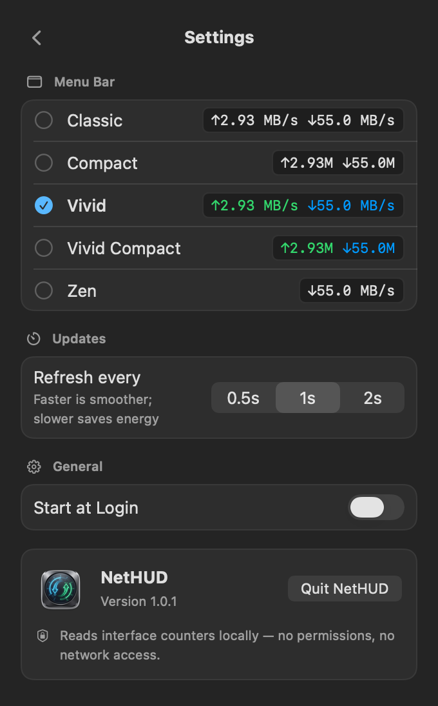
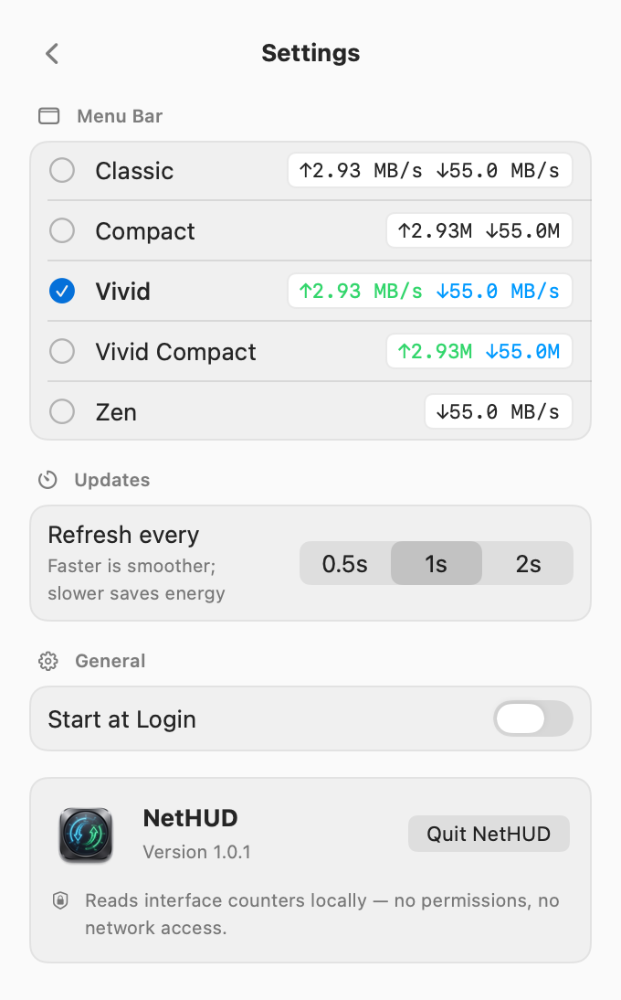
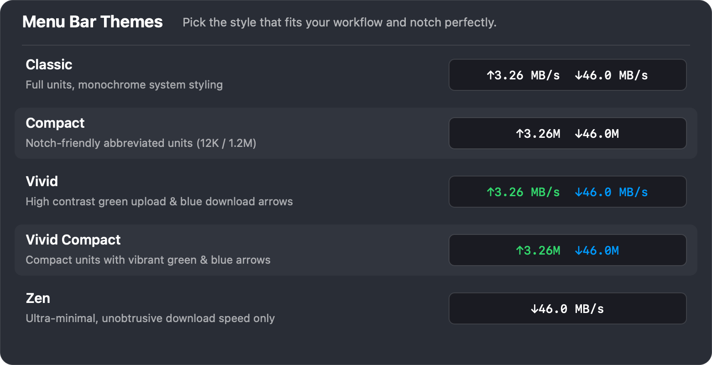

# NetHUD

A tiny macOS menu bar app that shows live network speeds:

```
↑12 KB/s ↓1.2 MB/s
```


<p align="center">
  
</p>

## Features

- **Live upload/download speeds** in the menu bar, always visible
- **Primary-interface tracking** — follows the default route (`en0` on Wi-Fi,
  `utun*` when a VPN is up), so traffic is never double-counted across tunnels
- **Live 60-second graph** — a dark instrument panel with a mirrored chart
  (download above the axis, upload below, each on its own scale) plus
  session peak speeds
- **Per-interface breakdown** with connection status, interface icons, and
  the primary (default-route) interface highlighted
- **Session totals** with elapsed time and a one-click reset
- Configurable refresh rate (0.5s / 1s / 2s), remembered across launches
- Five **menu bar themes**, previewed live in Settings with your current speeds:
  - *Classic* — `↑12 KB/s ↓1.2 MB/s`
  - *Compact* — `↑12K ↓1.2M` (notch-friendly)
  - *Vivid* — Classic with green ↑ / blue ↓ arrows
  - *Vivid Compact* — colored + compact
  - *Zen* — `↓1.2M`, download only
- Reads byte counters via `getifaddrs()` — no permissions, no network extension,
  no third-party dependencies

## Screenshots

### Native Menu Bar

Compact, monospaced live speed readout that never causes neighboring icons to jitter or shift:

<picture>
  <source media="(prefers-color-scheme: dark)" srcset="Docs/menubar-dark.png">
  <source media="(prefers-color-scheme: light)" srcset="Docs/menubar-light.png">
  
</picture>

### Detailed Popover

Click the menu bar readout anytime for the live graph, per-interface speeds, and session totals (settings live behind the gear, or ⌘,):

<p align="center">
  
  &nbsp;&nbsp;&nbsp;&nbsp;
  
</p>

### Settings

Tap the gear (or press ⌘,) to pick a menu bar theme — each one previewed live with your current speeds — set the refresh rate, and toggle Start at Login:

<p align="center">
  
  &nbsp;&nbsp;&nbsp;&nbsp;
  
</p>

### Five Menu Bar Themes

Choose the look that best complements your wallpaper, menu bar density, and MacBook notch:

<p align="center">
  
</p>

## Install

### Homebrew

```bash
brew install --cask HamzaSamirAmmar/tap/nethud
xattr -d com.apple.quarantine /Applications/NetHUD.app
```

NetHUD is ad-hoc signed (not notarized), so macOS blocks the downloaded copy
on first launch — the `xattr` line clears that once and works on every
Homebrew version. (On older Homebrew you can append `--no-quarantine` to the
install command instead; right-click → **Open** → **Open** in Finder works too.)

### From a release

Download `NetHUD.zip` from the [Releases](../../releases) page, unzip, and drag
`NetHUD.app` to `/Applications`. Right-click the app → **Open** → **Open** to
get past the first-launch warning.

### Build from source

```bash
xcodegen generate          # requires: brew install xcodegen
xcodebuild -project NetHUD.xcodeproj -scheme NetHUD -configuration Release \
  -derivedDataPath build SYMROOT=build/Release build
cp -R build/Release/Release/NetHUD.app /Applications/
```

Or open `NetHUD.xcodeproj` in Xcode and press Cmd+R.

Start at login: click the NetHUD menu bar item and flip **Start at Login**
(or add it manually under System Settings → General → Login Items).

## Troubleshooting

**The app won't open / quits immediately.** Gatekeeper is blocking the
un-notarized download. Approve it once:

```bash
xattr -d com.apple.quarantine /Applications/NetHUD.app
```

or right-click NetHUD.app → **Open** → **Open** in Finder.

## Privacy

NetHUD collects nothing, sends nothing, and phones nobody. It reads interface
byte counters from the operating system and renders them locally. That's the
whole app.

## Requirements

- macOS 13 Ventura or later
- Xcode 14+ only if building from source

## License

[MIT](LICENSE) © 2026 Hamza Ammar
